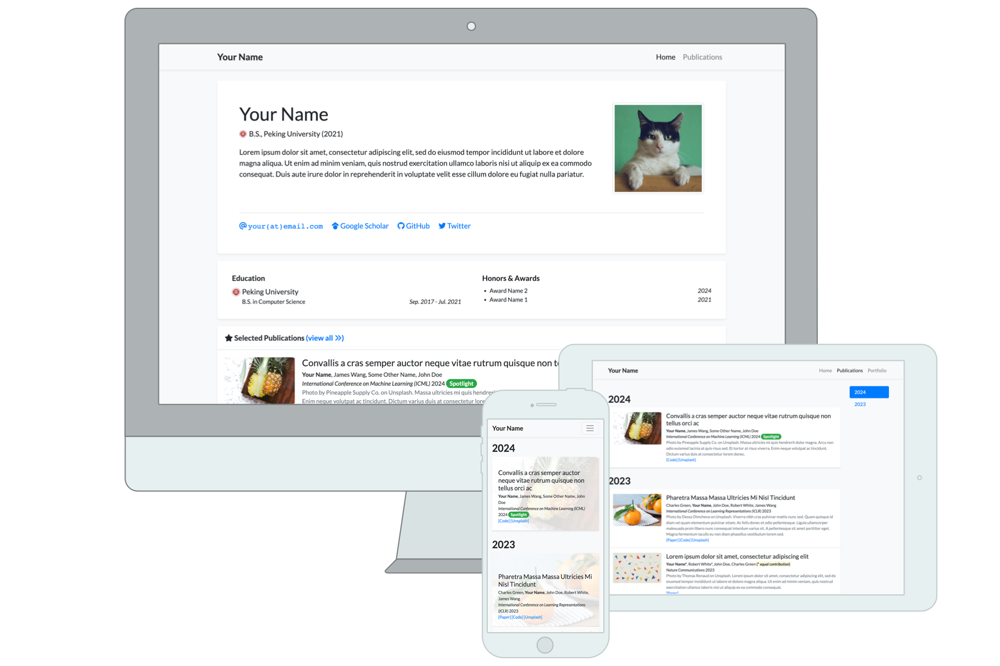

# academic-homepage



[](https://github.com/luost26/academic-homepage/actions/workflows/pages/pages-build-deployment)
[](https://validator.nu/?doc=https%3A%2F%2Fluost26.github.io%2Facademic-homepage)
[](https://hits.sh/github.com/luost26/academic-homepage/)
[](https://github.com/luost26/academic-homepage)
[](https://github.com/luost26/academic-homepage/forks)

A GitHub Pages (Jekyll) template for personal academic website. Click [here](https://luost.me/academic-homepage/) to see the demo.

## ✨ What's New in This Enhanced Version (v1.1.0)

This template builds upon the excellent foundation from luost26 with significant enhancements to create a more professional, visually appealing, and feature-rich academic portfolio.

### 🖼️ Visual Enhancements
- **Optimized profile buttons** with smooth hover animations and improved visual effects
- **Refined icon system** for better aesthetics and consistency across the site
- **Harmonized UI elements** with thoughtful color coordination and spacing
- **Improved typography** with better font spacing and readability
- **Subtle dynamic effects** throughout the interface for enhanced user experience

### 📝 Content Organization & New Features

#### 🎤 Talk Cards
- Added embedded slides and video support with proper platform handling
- Enhanced "View Full" button with platform-specific URL conversion (fixed YouTube/Bilibili issues)
- Auto-sorted entries by date (newest first)
- Scrollable container showing top entries with easy access to full content

#### 👨‍🎓 Experience & Education
- Added dedicated lab sections with proper formatting
- Enhanced advisor information display with links and proper styling
- Improved long text handling for laboratory names with precise line breaks

#### 🆕 New Cards
- **Academic Service** card for showcasing professional contributions
- **News** card with top entries displayed by default and scrollable container for full content
- **Publication** card with:
  - Beautiful, intuitive icons for paper, arXiv, website, demo, and code
  - Index terms module for research categorization
  - 3D zoom effect when hovering over publication images for better visibility
- **Fast Q&A** card redesigned to help visitors quickly understand your background

### 🌟 User Experience Improvements
- Intuitive navigation with thoughtful information hierarchy
- Responsive design that works flawlessly across all devices
- Optimized performance with lazy loading for media content
- Improved accessibility with proper contrast ratios and semantic HTML

## User Community

[🏡](https://luost.me/)
[:star:](https://cch1999.github.io/)
[:star:](https://kyrrego.github.io/)
[:star:](https://ced3-han.github.io/)
[:star:](https://lihengchen.com/)
[:star:](https://hpwang-whu.github.io/)
[:star:](https://zhang-yingyi.github.io/)
[:star:](https://wby24.github.io/)
[:star:](https://pengfeixu.com/)
[:star:](https://boqiuphd.github.io/)
[:star:](https://www.huabing.li/)
[:star:](https://xiecuiying.github.io/)
[:star:](https://hannyang.github.io/)
[:star:](https://king-play.github.io/)
[🤖](https://andrewcwlee.github.io)
[:star:](https://laiyao1.github.io)
[🌜](https://tmsultan.github.io)
[🚀](https://zaxguo.github.io)
[:gemini:](https://hongyang-du.github.io)
[🇻‍🇳](https://thuanz123.github.io)
[🧬](https://gdalba.github.io/)
[🇭🇰](https://yhhan.com/)
[🌔](https://chen-huaneng.github.io/academic)

:hugs: Feel free to tell us if you are using this template for your website by creating an issue [here](https://github.com/luost26/academic-homepage/issues/new?assignees=&labels=&projects=&template=user-report.md&title=I+am+using+this+template%21).

## Need Help?

If you run into **any** issues while using this template, or have suggestions for improvements, please don't hesitate to create an issue [here](https://github.com/luost26/academic-homepage/issues/new).

### FAQs
- [Need blogging feature?](https://github.com/luost26/academic-homepage/issues/13#issuecomment-2646371324)
- [How to show citation count for papers?](https://github.com/luost26/academic-homepage/issues/29#issuecomment-3222496187)

## Getting Started

1. First, fork this repository or click the "Use this template" button to create a new repository. The name of the repository should be `<your-github-username>.github.io` (click [here](https://docs.github.com/en/pages/getting-started-with-github-pages/about-github-pages#types-of-github-pages-sites) to learn more about naming a GitHub Pages repository).
   - If you plan to customize the functionality or style of the template, and do not want to get updates from this repository, choose "Use this template".
   - If you plan to only edit the content (biography, publications, news, etc.), and would like to get updates from this repository, choose "Fork".
   - If you want to contribute to this project, fork the repository and submit a pull request.

### Running Locally (Debug & Preview)

2. Follow the **step 1** and **step 2** of the instruction [here](https://jekyllrb.com/docs/) to install prerequisites and jekyll.

3. Clone your forked repository to your local machine.

4. Run the following command in the root directory of the repository:

   ```bash
   bundle exec jekyll serve
   ```

5. Browse to the displayed URL to see the website.

### Deploying to GitHub Pages

2. Go to the repository settings and enable GitHub Pages. Detailed instructions can be found [here](https://docs.github.com/en/pages/getting-started-with-github-pages/creating-a-github-pages-site#creating-your-site).

3. Navigate to your created website, and follow the instructions displayed on the homepage (if any) to finalize the setup.

## 🔗 Resources
[Original template](https://github.com/luost26/academic-homepage) - Special thanks to luost26 for the excellent foundation! ❤

[My modified version](https://github.com/rekkles2/rekkles2.github.io) - Feel free to use and contribute!

*Enjoy a professional, visually appealing, and feature-rich academic portfolio!* 🍧🍾🍷
